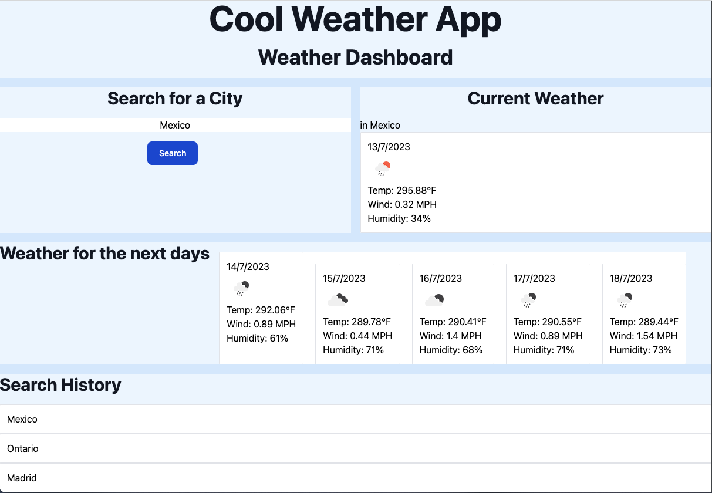

Cool Weather App!!

You can find the repository here: https://github.com/mxmar0k/theweatherapp

And you can find the page live at: https://mxmar0k.github.io/theweatherapp/ 

Hello girls and boys and everyone!

Here is my super cool weather app.

Ok it is not so cool, but anyway Im exited. Because, even tho I have the suspicion that I created too much code, it somehow works.

In this app we used tailwind via node (it's my first time, so be patient and dont laught too much).

The html is based on grid, because honestly i just dont get flex and it was driving me crazy, i ended up changing the whole layout. Grid was much more easier and user friendly. I regret discovering til now.

As you can see there are 4 main grid elements that comunicate with the JS

The first is the search part, were we have an input text for the user to look for a city and a search button.

We have a current weather to append the card of the  current climate

next we have a section for the next 5 days, if you're living in mexico city this does not apply, because the weather never makes sense.

Finally we have a search history which is interactive and you can push on the searched cities and can log the info again updated.

Next we go to the js and oh boy...

The js was modern torture

We have various functions to retrieve/save and load the search history user interface (how fancy). We also added event listeners so when you click it loads the information. 

The main function (i think) is the one where we fetch the long and latitude via the api key. So when we type a city it retrieves that information and we can use that in another api url. 

The other part is get the weather details, but it must be filtered so that we get different days, i actually got it wrong the fist time and i was getting 3 hour lapses hahaha kill me.

Then we have to retrive the information for the array 0, which is the current weather and append it to the html section where it belongs.

We use slice to filter that information.

Then we do the same for the next days, it is basically the same function, but now the slice is 1-6, then we append the cards to the corresponding part of the html:

 19.08.22.png>)

we have an event listenet to get the user input (the city), to get the coordinates and then we use that coordinates as an input to the getWeatherDetails functions, and we add also to the search history.

The js has a more precise explanation. Hope you enjoy it.

